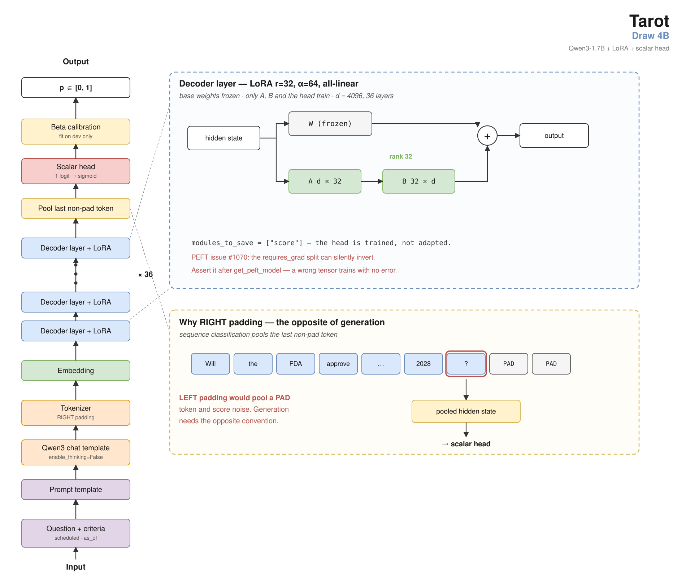

# Cournot-Cold 1.7B

**The small end of the Cournot-Cold ladder.** It answers the same interface as
the 8B and 4B, on a base model 4.7× smaller than the flagship.

```
input:  question + resolution criteria + resolution date + as_of
output: p ∈ [0,1]
```



**Weights:** [`Laplace-AI-Research/cournot-cold-1-7b`](https://huggingface.co/Laplace-AI-Research/cournot-cold-1-7b)
on the Hugging Face Hub — LoRA adapter.
**Larger siblings:** [`Cournot-Cold 4B`](https://huggingface.co/Laplace-AI-Research/cournot-cold-4b)
and [`Cournot-Cold 8B`](https://huggingface.co/Laplace-AI-Research/cournot-cold-8b)
— same 81,870 questions, same targets, same seed, same footing. **Take the 4B
unless it will not fit**: it ties the 8B and beats this model by
+0.0119 Brier [+0.0080, +0.0158] on the dev split. See **Training variance**
below before reading that interval as tight.
**Evidence:** [`Laplace-AI-Research/cournot-cold-1-7b`](https://github.com/Laplace-AI-Research/cournot-cold-1-7b)
on GitHub — the eval splits behind every claim, this model's raw forecasts
(including the venue transfers where it *failed*), the metric code, and
`verify.py`, which recomputes every number below without a model or a GPU.


No evidence, no retrieval, no market price. A question and a date, and a number.

## Read this first: the trade this model offers

**It is worse than the 4B, measurably, and that is the point of it existing.**

| | dev Brier (n=3,000) | vs Cournot-Cold 4B |
|---|---:|---|
| Cournot-Cold 8B | 0.1674 | — |
| Cournot-Cold 4B | 0.1684 | — |
| **Cournot-Cold 1.7B** | **0.1803** | **+0.0119 [+0.0080, +0.0158], significant** |

Paired, question-clustered bootstrap, 10,000 resamples, seed 20260822.

**The offer is roughly +0.012 Brier for 57% fewer parameters.** If you are running on a
laptop, on CPU, or anywhere the 8B does not fit, that is the trade. If you are not
constrained, **use the 4B** — it is free to run by comparison and it ties the 8B.

We are telling you to prefer a different model in most cases. That is the honest
reading of our own numbers and it belongs at the top of the card, not in a
footnote.

## The headline number

**Brier 0.2030** on the contamination-free published split, n=277 — questions that
resolved *after* the training freeze, so no part of this model saw them.

| | value |
|---|---:|
| Brier | 0.2030 |
| Murphy calibration ↓ | 0.0042 |
| Murphy resolution ↑ | 0.0518 |
| base rate | 0.4946 |
| base-rate Brier | 0.2500 |

`uv run python verify.py` recomputes every number above from the forecasts and
eval split in this repository. It needs no GPU, no weights and no network.

## Contamination

**Zero of the 3,000 dev questions, zero of the 277 published questions, and zero
of the 778 Kalshi transfer questions resolved before the base model was
released.** Outcome memorisation is closed by construction, not by argument.

- **Freeze: 2026-08-15**, committed in a dated, public git history *before* it
  passed.
- The split is gated on **`Qwen3-1.7B`'s public release date (2025-04-27)**, not
  on a stated pretraining cutoff — a release date is externally checkable, a
  cutoff is a vendor claim.

---

## What the size ladder actually shows

This is the finding the three models exist to support, and it is more interesting
than any one of them.

**Calibration is size-invariant on this task. Discrimination is not.**

| dev, n=3,000 | calibration ↓ | resolution ↑ |
|---|---:|---:|
| Cournot-Cold 8B | 0.0010 | 0.0718 |
| Cournot-Cold 4B | 0.0007 | 0.0708 |
| Cournot-Cold 1.7B | 0.0004 | 0.0593 |

Across a **4.7× parameter range**, calibration is flat — the differences are well
inside the ±0.003 seed-noise floor we measured. Every point of the degradation is
**resolution**.

**The small model learns *how confident to be* as well as the large one. What it
loses is *which questions to be confident about*.**

On the published split (n=277) the calibration point estimates do differ —
0.0048 / 0.0034 / 0.0042 — but that split is far too small to resolve a
difference of that size. That split is too small to
resolve a calibration difference this size, so the claim above rests on the dev
split, where there is power. Both are given.

## Calibration: none applied

The shipped probability is the head's raw `sigmoid(logit)`. **No post-hoc
calibration map is applied and none is distributed.** The calibration figures
above are what the model produces untuned.

## What this model cannot do

1. **It cannot beat the 4B.** See the top of this card.
2. **It cannot do mechanical threshold or counting questions.** Questions needing
   a time series and precise arithmetic are outside a judgment prior.
3. **Short horizons.** Under 7 days it never beats a market crowd at any point in
   a question's life.
4. **Calibration does not transfer to a new venue.** A new venue needs its own
   calibration mapping, fit on that venue's own development split.

## Transfer, measured on this model

Scored off-venue on 778 Kalshi judgment questions and 3,000 Polymarket questions.
**Measured on this model, not inherited from a sibling.**

| | n | Brier | resolution | BSS |
|---|---:|---:|---:|---:|
| Manifold dev (home venue) | 3,000 | 0.1803 | 0.0593 | +24.7% |
| **Kalshi — Politics** | 209 | 0.0935 | **0.1143** | **+47.9%** |
| Kalshi — Elections | 461 | 0.2201 | 0.0078 | −19.0% |
| Kalshi — all | 778 | 0.1826 | 0.0319 | −0.4% |
| Polymarket (mechanical questions) | 3,000 | 0.2196 | 0.0045 | −17.2% |

**On Kalshi Politics this model discriminates better off-venue than at home** —
resolution 0.1143 against 0.0593. **On Kalshi Elections it collapses**, and the
all-Kalshi aggregate of −0.4% is a composition artifact: 59% of that corpus is
obscure local elections, which are a lookup rather than a forecast.

**Polymarket is where it is worst.** Resolution 0.0045 is close to none at all —
those questions are mechanical (scores, thresholds, spreads) and outside what a
judgment prior can do.

### The contamination-free Kalshi subset, where this model loses to a constant

The 778 above include questions that resolved before the training freeze. **117
resolved after it**, and that subset is contamination-free by the same rule as the
published split. It is the least flattering number in this card, so it is here
rather than omitted.

| | n | Brier | resolution |
|---|---:|---:|---:|
| Cournot-Cold 1.7B | 117 | 0.2137 | 0.0179 |
| **a constant at the base rate (0.2308)** | 117 | **0.1775** | 0.0000 |

Paired bootstrap, 10,000 draws, clustered on `question_id`:

> **1.7B minus constant: +0.0362 [+0.0004, +0.0720] — significantly WORSE.**
> **1.7B minus 4B: +0.0246 [+0.0039, +0.0457] — significantly worse.**
> **1.7B minus 8B: +0.0073 [−0.0167, +0.0321] — not significant.**

**Read this as: on 117 contamination-free out-of-venue questions this model is
significantly worse than predicting the base rate on every one.** The 8B and 4B
are both merely *indistinguishable* from that constant; this model is beaten by
it.

The subset is small and lopsided — 88 of 117 are Elections, the stratum above
where this model is weakest — so it is not a verdict on the venue. It is a real
limit on off-venue use.

## Training variance, and why the intervals above are narrower than the truth

**This recipe was run twice, identically — same corpus, same seed, same learning
rate, same footing — and produced two significantly different models.**

| | dev Brier |
|---|---:|
| run 1 | 0.1752 |
| **run 2 (shipped here)** | **0.1803** |

> run 2 − run 1 = **+0.0051 [+0.0019, +0.0082]**, paired and question-clustered.

Individual forecasts between the two runs differ by up to **0.68**.

**Every interval in this card is a bootstrap over questions.** It captures
sampling variance and **does not capture training variance at all**. Two models
from an identical recipe land outside each other's intervals, so a
model-vs-model difference smaller than roughly **0.008 Brier should be treated as
unresolved**, whatever interval is printed beside it.

The +0.0119 gap to the 4B is above that bar. The calibration differences in the
size-ladder table are not, and are not claimed.

**The numbers in this card come from the run whose weights are published here**,
verified by recomputing them from the shipped forecasts. Run 1's figures are
retracted, and are shown above only to document the spread.

## Evaluation data

- **`published`** (headline, n=277) — Manifold questions resolving after
  2026-08-15. Never trained on. The only source of an external number.
- **`dev`** (n=3,000) — resolving 2025-08-15 to 2026-08-15. Gates iteration,
  **never published as a headline claim.**

Eval splits carry **question ids, dates and outcomes only** — no question text.
Each `question_id` is the venue's own stable identifier, so the text is
retrievable from that venue under that venue's terms rather than ours.

All intervals are paired, question-clustered bootstraps (10,000 resamples).
Seed-to-seed noise on this setup is **±0.003 Brier**, so smaller differences are
not findings. **That floor is now known to be understated** — see Training
variance below.

---

## Training

LoRA r=32, α=64 on `Qwen/Qwen3-1.7B` with a scalar regression head
(`Qwen3ForSequenceClassification`, `num_labels=1`, `modules_to_save=["score"]`),
Brier loss against the terminal 0/1 outcome. 81,870 Manifold questions resolving
before the freeze. Seed 20260822, LR 1e-4 OneCycle, right padding, last-non-pad
pooling, chat template on **both** train and score.

**Identical corpus, seed, learning rate and footing to the 8B and 4B** — the only
variable across the three is parameter count. That is what makes the ladder above
a measurement rather than three separate results.

## A note on the base model

An earlier internal evaluation rejected Qwen3-1.7B as mode-collapsed: 226 of 500
answers exactly 0.5, 46.2% of probability mass within 0.05 of it, 3.02 bits of
entropy. **That was measured at Q4 quantisation on generated probability tokens.**

This model is a bf16 scalar regression head, which does not generate. Its dev
output distribution: **22.0% within 0.05 of 0.5, 6.19 bits of entropy, 1,257
distinct values across 3,000 questions, sd 0.2571.** Not collapsed.

The earlier finding was about a substrate for prompt-based iteration, and it does
not transfer to a regression head.

## Licensing, in two parts

| what | licence | commercial use |
|---|---|---|
| **code** — `src/`, `scripts/`, `verify.py` | **Apache-2.0** (`LICENSE-CODE`) | **permitted** |
| adapter weights | CC BY-NC 4.0 (`LICENSE`) | not permitted |
| forecasts | CC BY-NC 4.0 (`LICENSE`) | not permitted |
| eval metadata — ids, dates, outcomes | CC BY-NC 4.0 (`LICENSE`) | not permitted |
| question text | **not redistributed here** | not ours to license |
| base model | Apache-2.0, by its authors | unaffected |

**The split is deliberate.** The evaluation code contains no third-party rights
and is permissively licensed, including for commercial use. The data-derived
artifacts cannot be, because the corpus they come from restricts it.

**Corrected 2026-08-29:** an earlier version of this repository shipped the code
with **no licence grant at all**, which under copyright means all rights reserved
— published, but not usable by anyone. That was not intended and is fixed here.

---

## Training data provenance and licensing

Adapter weights and evaluation metadata under CC BY-NC 4.0. Base model
`Qwen/Qwen3-1.7B` is Apache 2.0 and unaffected.

**No venue question text is redistributed here.** Eval splits carry question ids,
dates and outcomes only. Each `question_id` is the venue's own stable identifier,
so the text is retrievable from that venue directly under that venue's terms.

Training data derives from the Manifold Markets public API and is not
redistributed. Manifold's terms restrict bulk API data to personal and
non-commercial use and prohibit training ML models for commercial purposes without
a data licence; that licence is not ours to grant.

---

## Reproducing

Every headline number is recomputed from the shipped forecasts by `verify.py` —
**no model, no GPU, no network**:

```bash
uv run python verify.py
```

To regenerate those forecasts from the weights instead:

```bash
uv run python scripts/scalar_score.py \
  --adapter Laplace-AI-Research/cournot-cold-1-7b \
  --base-model Qwen/Qwen3-1.7B \
  --set eval/published_eval.json \
  --out published.jsonl \
  --chat-template
```

---

## Intended use

Base rates and cold-start estimates where a larger model will not fit. Research on
scale and calibration. **Not** for trading, and not as a substitute for the 4B
where the 4B will run.

## Provenance of claims

Every number here is recomputed from the shipped forecasts by `verify.py`, in
this repository, with no model and no GPU. That is the check that matters and it
is the one you can run.

Behind it sits an internal decisions log recording how each number was derived
and which results **failed** — including, for this model, an earlier internal
decision *not* to train this base model at all, which rested on a measurement
taken at the wrong quantisation and on the wrong output head. **That log is not
public**, so nothing in this card depends on it: every claim above is either
reproducible from the files here or is stated as an unverifiable limitation.

---

## The family

| | parameters | dev Brier | use it when |
|---|---:|---:|---|
| [Cournot-Cold 8B](https://huggingface.co/Laplace-AI-Research/cournot-cold-8b) | 8B | 0.1674 | you want the best number |
| [Cournot-Cold 4B](https://huggingface.co/Laplace-AI-Research/cournot-cold-4b) | 4B | 0.1684 | almost always — it ties the 8B |
| **Cournot-Cold 1.7B** | **1.7B** | **0.1803** | the 4B will not fit |

All three share one corpus, one seed, one learning rate and one footing. The only
variable is parameter count.
